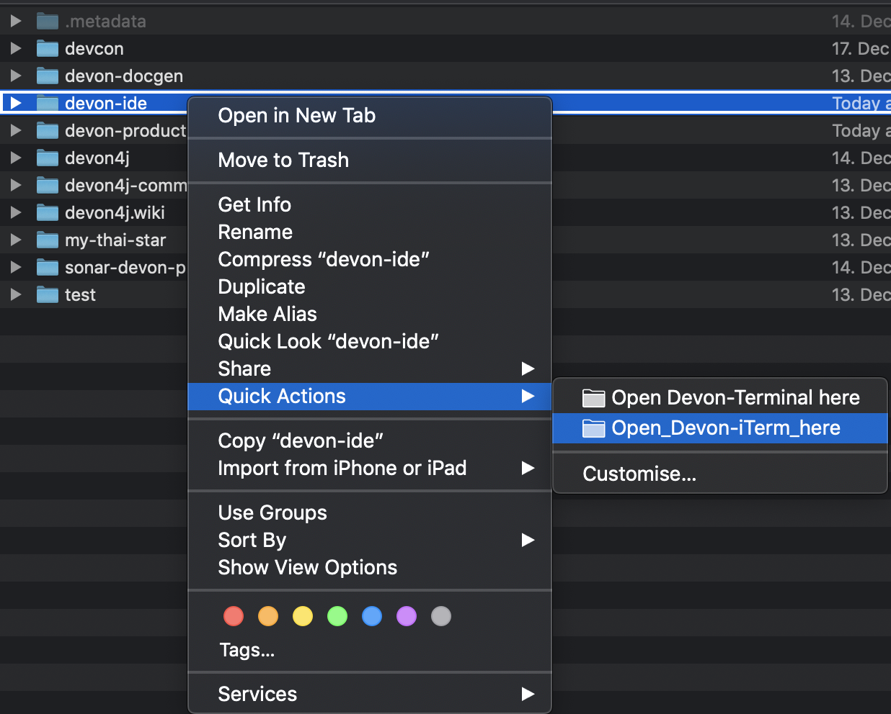

:toc: macro
toc::[]

= MacOS Integration

This folder contains configurations to integrate `devonfw-ide` into MacOS.

== Finder

If you want to open a terminal from a folder in `Finder` and automatically get your environment set properly for `devonfw-ide` you will find the perfect solution here.



So after installing (see below) the integration(s) provided here, you can easily open a terminal ready for your `devonfw-ide`:

* right click (`[control]` + click) on file or folder in `Finder`
* Expand the `Quick-Actions` sub-menu
* Click on the desired action (e.g. `Open Devon-Terminal here`)
* Verify that you environment is properly initialized by invoking:
+
```
mvn -v
```

=== Terminal

If you want the integration for the `Terminal` app on MacOS simply go to the `terminal` subfolder and double click on the contained `workflow` file.

=== iTerm2

If you prefer `iTerm2` (can be installed from `App Store`) simply go to the `iterm` subfolder and double click on the contained `workflow` file.

== Keyboard

Keyboard support is not an integration but however, some users coming from other platforms may struggle with the way MacOS deals with (external) keyboards. As an IDE is all about speed of development you need support for common shortcuts, etc. To make you fully productive without learning and getting used to new keyboard shortcuts you will find support in link:keyboard/Readme.adoc[].