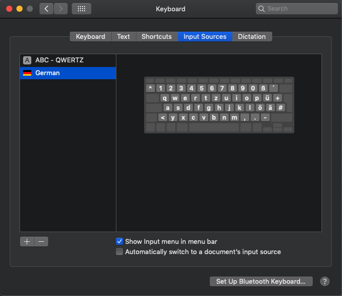
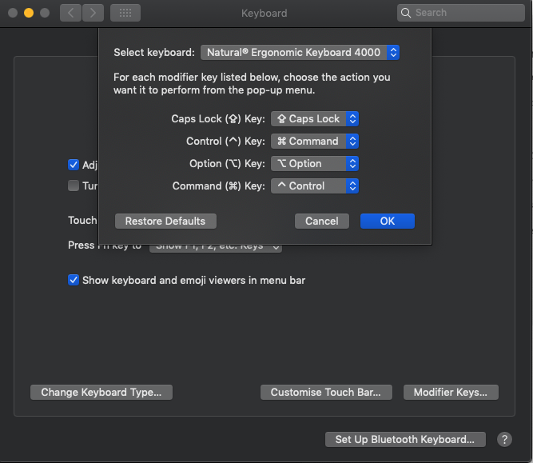

:toc: macro
toc::[]

= MacOS Keyboard Support

This folder contains configurations to improve support for external (non-apple) keyboards into MacOS. While some users might be born with MacOS and are happy with all the defaults some users come from Windows or Linux and are used to their current keyboard layout and shortcuts. As this issue of MacOS was driving me entirely nuts, I digged very deep for solutions and provide them here to help others. This documentation therefore aims to give ultimate guidance and rescue for all such people that want to make their (external) keyboard behave more like on Windows or Linux.

== Keyboard Layouts

Keyboard-Layouts allow a find grained mapping of each key on your keyboard to its resulting input character or behaviour. They are a MacOS native features and do not need to have software running as background service to make the keyboard mapping work (see Karabiner section below as alternative).
They are provided as so called `bundle` (white lego brick icon). Like a MacOS app this is a folder containing a `Contents` folder with a specific sub-folder structure. In the `Resources` subfolder `*.keylayout` files are placed that define the exact mapping for the keyboard. As an example we provide a `Keyboard Layouts` folder containing a `bundle` for a German keyboard mapping.

To install keyboard layouts simply copy the `bundle` to `/Library/Keyboard Layouts`. To actually use them go to `System Preferences` and select `Keyboard`. Then select the tab `Input Sources`. With the `+` button you can add a keyboard layout for your daily usage with your mac. 



When you have multiple mappings in place, on the top menu bar you will find a little icon next to the current time that allows you to switch between the keyboard layouts, what is very handy when you switch from your native MacBook keyboard to an external USB keyboard or vice versa.
Even for a pure MacOS geek this can be helpful in case a friend coming from Windows/Linux is supposed to type something on the Mac in a pair-programming session.

In our German keyboard mapping example you can use the keys like `Alt Gr`, etc. to type special characters as you would expect and as printed on your keyboard. To make `Pos1`, `End`, etc. work properly accross all apps please read on to the next section(s).

In case you want to create your own keyboard layout you can of course edit the `*.keylayout` files in a text editor. However, to make this much more comfortalbe, you can use the graphical editor tool https://scripts.sil.org/ukelele[Ukelele].
Besides the app itself the Ukelele `dmg` file also contains a `Documentation` and a `Resources` folder. The latter contains many keyboard layouts that you can use as a starting point. 

== Switch Control and Command

If you are used to windows or linux and get easily confused by the apple keyboard behaviour you might want to switch the `Control` and the `Option` key.
Open `System Preferences` and select `Keyboard`. Then in the first tab you click on the button `Modifier Keys...`. For every keyboard you can customize the behaviour of your modifier keys and therefore switch `Control` and `Option` as illustrated in the screenshot:


Programmers now should also disable that `Control` + `Space` is opening `Spotlight Search` as otherwise this shortcut can not be redifined in other apps like common IDEs.

image:keyboard-shortcuts.png["Keyboard Preferences / Shortcuts",link=keyboard-shortcuts.png]

== KeyBindings

Still various keyboard shortcuts might not work as expected for you. Therefore we provide you with a folder named `KeyBindings` that you can copy to your `~/Library` folder:
```
cp -r KeyBindings ~/Library
```
To make the changes work you need to log-out and log-in again or you can reboot. After that your `Home` (`Pos1`) and `End` buttons should work as expected including with selection via `Shift` and/or `Command` (if switched as described above always use `Control` instead starting from here). Also you can use `Command` together with left or right arrow key to move between words and combined with `Shift` for selection. As an example for further customization you can press `Command` + `<` to type the unicode character `«`.

However, still some apps listen to keyboard events on a lower level and come with their own keyboard mappings. In these apps you might still experience unexpected behaviour. Solutions can be found in the following sub-sections.

=== Eclipse

In Eclipse move and select by word as described above is not working. Even worse the most important shortcut does not work: `Control` + `Space` for code completion (content assist). You can manually redefine the keybindings in `Preferences` under `General > Keys`. However, with multiple IDE installations and workspaces this will quickly get tedious. Therefore, you can `Export` and `Import` specific `Preferences` such as `Keys Preferences` to/from a `*.epf` (Eclipse PreFerences) file.
We have done all this for you so you can just import the file located in `Eclipse/eclipse-mac-keybindings.epf` into your Eclipse. Happy coding.

== Karabiner

If you want more dynamics and do not worry about an app that has to run in the background to make your keyboard work as you like (no relevant performance overhead), you can try https://pqrs.org/osx/karabiner/[Karabiner Elements]. This is a powerful tool to remap your keyboard shortcuts. In the UI you can only directly create and edit `Simple Modifications` that are too limited for most use-cases. However using `Complex Modifications` you can do a lot of magic to customize the keyboard behaviour to your personal needs. A key with any combination of modifiers can be mapped to any key with arbitrary modifiers. This can also be bound to conditions based on the frontmost application or the keyboard model. These complex modifications are configured as `*.json` files. We have included a set with useful rules for external keyboards, programmer shortcuts, etc. If you have Karabiner installed, you only need to copy the contents of the `karabiner` folder located in this directory to your `~/.config` folder:
```
cp karabiner/assets/complex_modifications/*.json ~/.config/karabiner/assets/complex_modifications/
```
Now, if you open the `Complex Modifications` in the `Karabiner` app, you can click on the `+ Add rule` button and will see these mappings in the popup. Select the rules you want to add (e.g. add all) and you are done. Unlike other solutions here you can quickly tweak your keyboard without the need to logout and restart apps what gives faster trial and error turn-arounds. Furhter, if you want to tweak your own configs, Karabiner comes with a secondary app called `Karabiner-EventViewer` that shows you the names of the keys, modifiers, and apps for the events you are triggering. This is very helpful to get the config right.